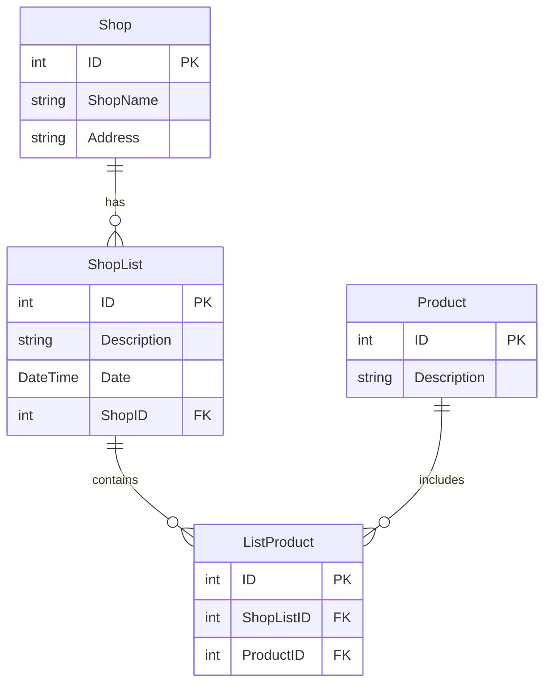

# Shopping Lists - .NET MAUI Multi-Platform Application

A cross-platform mobile application built with .NET MAUI that helps users manage shopping lists, products, and stores with location-based features.

## Features

- **Multi-Platform Support**: Runs on Android, iOS, Windows, and macOS
- **Shopping List Management**: Create, edit, and delete shopping lists
- **Product Library**: Maintain a collection of frequently purchased products
- **Store Management**: Save favorite stores with addresses
- **Location Services**: 
  - Get directions to stores via integrated maps
  - Receive notifications when near a saved store location
- **Data Validation**: Input validation with visual feedback
- **Local Database**: SQLite database for offline data persistence
- **Modern UI**: Clean, intuitive interface with tab-based navigation

## Architecture

### Project Structure

```
Lupu_Catalina_Lab7/
├── Models/
│   ├── ShopList.cs          # Shopping list entity
│   ├── Product.cs           # Product entity
│   ├── ListProduct.cs       # Junction table for many-to-many relationship
│   └── Shop.cs              # Store entity
├── Data/
│   └── ShoppingListDatabase.cs  # Database operations
├── Pages/
│   ├── MainPage.xaml        # Welcome page
│   ├── AboutPage.xaml       # About page
│   ├── ListEntryPage.xaml   # Shopping lists overview
│   ├── ListPage.xaml        # Individual list details
│   ├── ProductPage.xaml     # Product management
│   ├── ShopEntryPage.xaml   # Stores overview
│   └── ShopPage.xaml        # Store details
├── ValidationBehaviour.cs   # Input validation behavior
└── AppShell.xaml           # Navigation shell
```

### Database Schema



## Getting Started

### Prerequisites

- Visual Studio 2022 (17.3 or later)
- .NET 7.0 SDK or later
- .NET MAUI workload installed
- Android SDK (for Android development)
- Hyper-V enabled (for Android emulator acceleration)

### Installation

1. **Clone the repository**
   ```bash
   git clone https://github.com/Cata716/LupuCatalinaLab7.git
   cd Lupu_Catalina_Lab7
   ```

2. **Restore NuGet packages**
   ```bash
   dotnet restore
   ```

3. **Build the solution**
   ```bash
   dotnet build
   ```

4. **Run the application**
   - Select your target platform (Android Emulator, Windows Machine, etc.)
   - Press F5 or click the Run button in Visual Studio

## Dependencies

- **sqlite-net-pcl** (1.8.116) - SQLite database support
- **SQLiteNetExtensions** (2.1.0) - Relationship management for SQLite
- **Plugin.LocalNotification** (10.1.3) - Local notifications

## Configuration

### Android Emulator Setup

1. Enable Developer Mode in Windows:
   - Search for "Windows Features"
   - Enable "Hyper-V" and "Windows Hypervisor Platform"
   - Restart your computer

2. Verify Hyper-V compatibility:
   ```cmd
   systeminfo
   ```
   All Hyper-V requirements should show "Yes"

3. Create an Android emulator through Android Device Manager in Visual Studio

### Required Permissions (Android)

The app requires the following permissions in `AndroidManifest.xml`:
- `ACCESS_COARSE_LOCATION` - For location-based features
- `ACCESS_FINE_LOCATION` - For precise location tracking

## Usage

### Creating a Shopping List

1. Navigate to the "My Shopping Lists" tab
2. Tap "Add Shopping List"
3. Enter a description
4. Select a store from the dropdown
5. Tap "Save"

### Adding Products

1. Open a shopping list
2. Tap "Add/Choose Item to buy"
3. Select existing products or create new ones
4. Products are automatically added to your list

### Managing Stores

1. Navigate to the "My Shops" tab
2. Tap "Add Shop"
3. Enter store name and address
4. Tap "Save Shop"
5. Use "Show on Map" to get directions

### Location Features

- The app calculates distance to stores using your current location
- When within 5km of a store with pending shopping lists, you'll receive a notification
- Tap "Show on Map" to open navigation in your device's default maps app

## Branch Structure

- `master` - Lab 7: Basic MAUI application with navigation
- `Laborator8` - Lab 8: Database integration and CRUD operations
- `Laborator9` - Lab 9: Product management and validation behaviors
- `Laborator10` - Lab 10: Location services and notifications

## Development Workflow

### Creating a New Feature Branch

```bash
git checkout master
git pull origin master
git checkout -b feature/your-feature-name
```

### Switching Between Labs

```bash
# View available branches
git branch -a

# Switch to a specific lab
git checkout Laborator8
git checkout Laborator9
git checkout Laborator10
```

## Testing

### Running on Android Emulator

1. Select "Android Emulator" from the debug dropdown
2. Choose your configured emulator device
3. Click Run

### Running on Windows

1. Enable Developer Mode in Windows Settings
2. Select "Windows Machine" from the debug dropdown
3. Click Run

### Testing on Physical Android Device

1. Enable Developer Mode on your device
2. Enable USB Debugging
3. Connect device via USB
4. Allow USB file transfer
5. Device should appear in Visual Studio's device list

## Key Concepts Demonstrated

- **XAML UI Development**: Declarative UI with data binding
- **MVVM Pattern**: Separation of concerns with BindingContext
- **SQLite Database**: Local data persistence with relationships
- **Async/Await**: Asynchronous database operations
- **Platform Services**: Geolocation, mapping, geocoding
- **Behaviors**: Reusable UI validation logic
- **Navigation**: Shell-based navigation with tabs and stack navigation

## Code Examples

### Database Operations

```csharp
// Save a shopping list
var shopList = new ShopList 
{ 
    Description = "Weekend groceries",
    Date = DateTime.UtcNow,
    ShopID = selectedShop.ID
};
await App.Database.SaveShopListAsync(shopList);

// Get all products
var products = await App.Database.GetProductsAsync();
```

### Location Services

```csharp
// Get current location
var myLocation = await Geolocation.GetLocationAsync();

// Calculate distance
var distance = myLocation.CalculateDistance(shopLocation, DistanceUnits.Kilometers);

// Open maps
await Map.OpenAsync(shopLocation, new MapLaunchOptions { Name = "My Store" });
```

### Notifications

```csharp
var request = new NotificationRequest
{
    Title = "Shopping nearby!",
    Description = shop.Address,
    Schedule = new NotificationRequestSchedule
    {
        NotifyTime = DateTime.Now.AddSeconds(1)
    }
};
LocalNotificationCenter.Current.Show(request);
```

## Known Issues

- Location services may require manual permission grant on first run
- Android emulator location must be set manually via Extended Controls
- Windows builds require Developer Mode enabled

## Learning Resources

- [.NET MAUI Documentation](https://docs.microsoft.com/dotnet/maui/)
- [SQLite-net Documentation](https://github.com/praeclarum/sqlite-net)
- [XAML Documentation](https://docs.microsoft.com/xaml/)

## Contributors

This project was developed as part of a mobile application development course.

## License

This project is licensed for educational purposes.

## 🙏 Acknowledgments

- Course materials and lab instructions
- .NET MAUI community and documentation
- SQLite-net and Plugin.LocalNotification library maintainers

---

